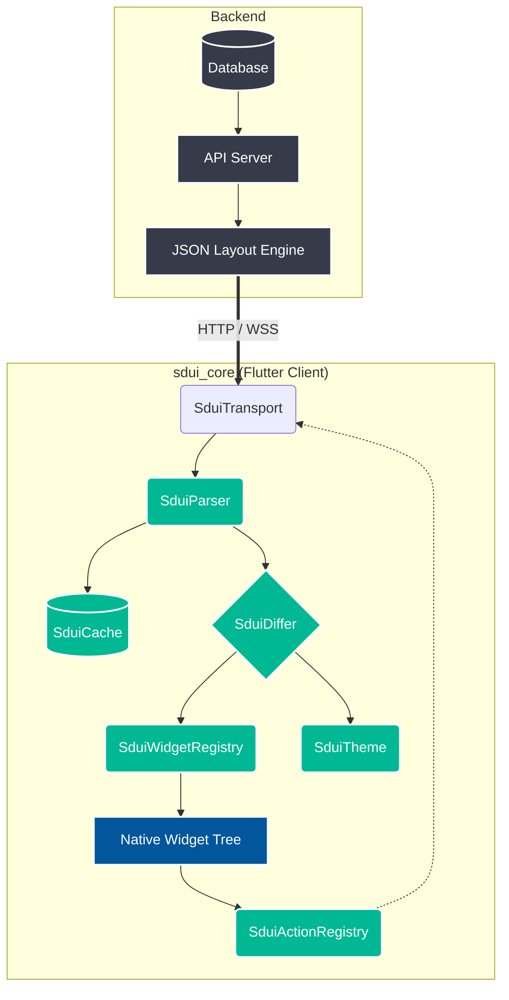
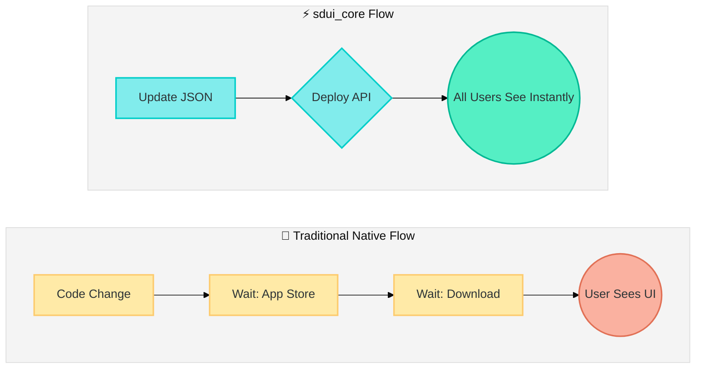
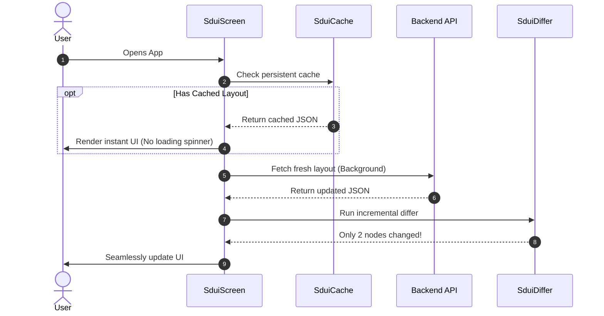
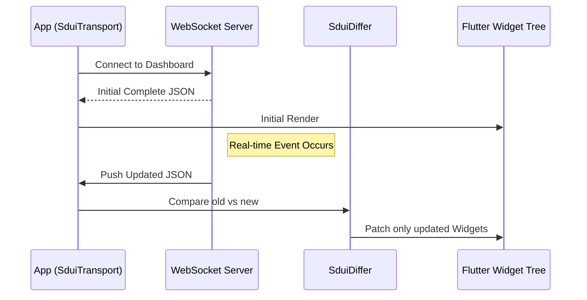

<p align="center">
  
</p>

# sdui_core

[](https://pub.dev/packages/sdui_core)
[](https://flutter.dev)
[](https://github.com/hrushikeshhd18/sdui_core/actions)
[](https://codecov.io/gh/hrushikeshhd18/sdui_core)
[](https://github.com/hrushikeshhd18/sdui_core/stargazers)
[](LICENSE)

A production-grade **Server-Driven UI** engine for Flutter. Your backend describes the layout; `sdui_core` renders it as a real native widget tree — no WebView, no code generation, no App Store review for UI changes.

<br>



---

## Why server-driven UI?

In a typical Flutter app, UI changes require a native release: build, review, rollout, and then wait for users to update. Server-driven UI breaks that cycle.

```
Traditional                        Server-driven
──────────────────────────         ──────────────────────────
Backend API  ─► App code           Backend API  ─► JSON layout
App release  ─► App Store          Deploy JSON  ─► Live instantly
User updates ─► User sees change   All users    ─► See change now
```

<br>



`sdui_core` is the Flutter side of this equation. It takes a JSON payload from your server and renders a fully native widget tree — every tap, animation, and gesture is handled in Flutter, not a browser.

**When it pays off:**
- A/B testing layouts without a native release
- Feature flags that control which UI sections appear
- Promotional banners, onboarding flows, or seasonal screens you update daily
- White-labelling the same app shell for multiple clients with different layouts
- Fixing a production UI bug in minutes, not weeks

---

## Features

| | |
|---|---|
| **28+ built-in widget types** | Text, image, button, grid, list, card, column, row, stack, and more |
| **Material 3 + Cupertino** | Full platform-aware widget sets out of the box |
| **7-state screen machine** | `loading`, `loadingWithCache`, `success`, `refreshing`, `error`, `errorWithCache`, `empty` |
| **Stale-while-revalidate cache** | Instant render from cache while fresh data loads in the background |
| **Abstract transport layer** | Swap HTTP for WebSocket or any custom transport in one line |
| **Incremental differ** | Rebuilds only nodes that changed (by `id + version`) |
| **Conditional rendering** | `"visible_if"` prop for feature flags and A/B testing |
| **Named text themes** | `SduiTheme` lets the server control typography without a native release |
| **Action middleware** | Intercept, log, or transform any user interaction |
| **Action debouncing** | Built-in double-tap protection, configured server-side |
| **Isolate-based parsing** | JSON decoded off the UI thread by default |
| **Type-safe prop accessors** | `SduiProps` with color, edge-insets, alignment helpers |
| **Debug overlay** | Long-press any node to inspect its id, type, path, and props |
| **Sealed exception hierarchy** | Every error has a code, message, and actionable hint |
| **Fully testable** | Non-singleton registries and mock transport helpers included |

---

## Installation

```yaml
# pubspec.yaml
dependencies:
  sdui_core: ^0.2.0
```

```
flutter pub get
```

---

## Quick start

The minimum integration is three lines. Everything else is opt-in.

```dart
void main() async {
  WidgetsFlutterBinding.ensureInitialized();
  await SduiCache.init(); // enables stale-while-revalidate persistence

  runApp(
    SduiScope(
      child: MaterialApp(
        home: SduiScreen(url: 'https://api.example.com/layouts/home'),
      ),
    ),
  );
}
```

`SduiScope` provides the default registries (all 28 core widgets pre-registered).
`SduiScreen` fetches, validates, parses, caches, and renders the layout.

---

## JSON payload format

Your backend returns a single JSON document. Every node has an `id` (stable key for diffing), a `version` (bump it to trigger a re-render), `props` (config for the widget), and `actions` (what happens on gestures).

```json
{
  "sdui_version": "1.0",
  "root": {
    "type": "sdui:column",
    "id": "home_root",
    "version": 3,
    "props": { "padding": 16 },
    "actions": {},
    "children": [
      {
        "type": "sdui:text",
        "id": "headline",
        "version": 1,
        "props": {
          "text": "Welcome back, Alex",
          "style": "h1",
          "color": "#1A1A2E"
        },
        "actions": {}
      },
      {
        "type": "sdui:button",
        "id": "cta_shop",
        "version": 2,
        "props": {
          "label": "Shop the sale",
          "variant": "filled",
          "visible_if": "props.isSaleActive"
        },
        "actions": {
          "onTap": {
            "type": "navigate",
            "event": "open_sale",
            "payload": { "route": "/sale", "source": "home_cta" }
          }
        }
      }
    ]
  }
}
```

> **`visible_if`** — the `"props.isSaleActive"` expression is resolved against the node's own props at render time. Set `"isSaleActive": false` server-side to hide the button without a new release.

---

## Real-world examples

### 1. Home screen with auth, caching, and analytics

A typical production home screen: authenticated request, stale-while-revalidate cache so users never stare at a spinner on launch, pull-to-refresh, and every action event forwarded to your analytics pipeline.

```dart
class HomeScreen extends StatelessWidget {
  const HomeScreen({super.key, required this.token});
  final String token;

  @override
  Widget build(BuildContext context) {
    return SduiScreen(
      url: 'https://api.example.com/layouts/home',
      headers: {'Authorization': 'Bearer $token'},
      enableCache: true,           // serves last layout instantly on launch
      pullToRefresh: true,
      refreshInterval: const Duration(minutes: 10),
      loadingBuilder: (_) => const _HomeSkeleton(),
      errorBuilder: (_, error) => _HomeError(error: error),
      emptyBuilder: (_) => const _HomeEmpty(),
      onLoad: () => AnalyticsService.track('home_rendered'),
      onEvent: (event, payload) {
        AnalyticsService.track(event, properties: payload);
      },
      onError: (error) {
        ErrorReporter.capture(error, hint: 'home_sdui_fetch');
      },
    );
  }
}
```

<br>



---

### 2. Registering custom widgets

Out-of-the-box widgets cover the majority of layouts. For anything app-specific — branded cards, custom charts, native maps — register a builder.

```dart
void main() async {
  WidgetsFlutterBinding.ensureInitialized();
  await SduiCache.init();

  final registry = SduiWidgetRegistry()
    ..registerAll(createCoreWidgets())
    ..registerAll(createMaterialWidgets())
    ..register('myapp:product_card', _buildProductCard)
    ..register('myapp:rating_bar', _buildRatingBar)
    ..register('myapp:map_preview', _buildMapPreview);

  final actionRegistry = SduiActionRegistry()
    ..register('add_to_cart', _handleAddToCart)
    ..register('open_product', _handleOpenProduct);

  runApp(
    SduiScope(
      registry: registry,
      actionRegistry: actionRegistry,
      child: const MaterialApp(home: CatalogPage()),
    ),
  );
}

Widget _buildProductCard(SduiNode node, SduiBuildContext ctx) {
  final p = SduiProps(node.props);
  return ProductCard(
    title: p.getString('title'),
    subtitle: p.getString('subtitle'),
    imageUrl: p.getString('imageUrl'),
    price: p.getDouble('price'),
    badge: p.getStringOrNull('badge'),    // null = no badge shown
    onTap: () => _fireAction('onTap', node, ctx),
  );
}

Future<SduiActionResult> _handleAddToCart(
  SduiAction action,
  SduiActionContext ctx,
) async {
  final productId = action.payload['productId'] as String;
  final quantity = action.payload['quantity'] as int? ?? 1;
  await CartRepository.instance.add(productId, quantity: quantity);
  ScaffoldMessenger.of(ctx.flutterContext)
      .showSnackBar(const SnackBar(content: Text('Added to cart')));
  return const SduiActionResult.success();
}
```

The corresponding server JSON:

```json
{
  "type": "myapp:product_card",
  "id": "prod_42",
  "version": 1,
  "props": {
    "title": "Wireless Headphones",
    "subtitle": "Noise-cancelling · 30h battery",
    "imageUrl": "https://cdn.example.com/prod_42.jpg",
    "price": 149.99,
    "badge": "SALE"
  },
  "actions": {
    "onTap": {
      "type": "dispatch",
      "event": "add_to_cart",
      "payload": { "productId": "42", "quantity": 1 }
    }
  }
}
```

---

### 3. Feature flags and A/B testing with `visible_if`

`visible_if` evaluates server-side before any builder runs. The three supported forms:

```json
// Form 1: boolean literal — hardcoded show/hide
{ "visible_if": false }

// Form 2: prop expression — resolved from the node's own props map
{
  "visible_if": "props.isPremium",
  "props": { "isPremium": true, "text": "Pro feature" }
}

// Form 3: plain string — truthy unless empty or "false"
{ "visible_if": "enabled" }
```

A real A/B test: the server sends the same layout to all users but toggles `isPremiumBanner` based on cohort assignment. No native release needed.

```json
{
  "type": "myapp:promo_banner",
  "id": "premium_upsell",
  "version": 1,
  "props": {
    "isPremiumBanner": false,
    "visible_if": "props.isPremiumBanner",
    "title": "Upgrade to Pro",
    "color": "#6C3483"
  },
  "actions": {
    "onTap": {
      "type": "navigate",
      "event": "open_upgrade",
      "payload": { "route": "/upgrade", "source": "home_banner" }
    }
  }
}
```

---

### 4. Live updates over WebSocket

Replace the default HTTP transport with `WebSocketSduiTransport` to stream layout updates in real time — ideal for live sport scores, dashboards, or auction UIs.

```dart
SduiScreen(
  url: 'wss://api.example.com/layouts/dashboard/live',
  transport: WebSocketSduiTransport(
    reconnectDelay: const Duration(seconds: 3),
    maxReconnectAttempts: 10,
    pingInterval: const Duration(seconds: 25),
  ),
  // No enableCache needed — the stream is always fresh
  enableCache: false,
)
```

<br>



The server pushes a full JSON payload on every change. `SduiDiffer` compares the incoming tree against the current one by `id + version` and rebuilds only the changed nodes — the rest of the widget tree is untouched.

---

### 5. Incremental diffing

Use `SduiDiffer` to detect changes before applying them. This lets you animate transitions, log diff metrics, or conditionally apply updates.

```dart
class _DashboardState extends State<Dashboard> {
  SduiNode? _currentTree;

  void _onNewPayload(Map<String, Object?> payload) {
    final newTree = SduiParser.parse(payload);
    if (_currentTree == null) {
      setState(() => _currentTree = newTree);
      return;
    }

    final diff = SduiDiffer.diff(_currentTree!, newTree);
    if (!diff.hasDiffs) return; // nothing changed — skip rebuild

    debugPrint(
      'SDUI diff: ${diff.changedCount} changed, '
      '${diff.addedCount} added, ${diff.removedCount} removed',
    );

    setState(() => _currentTree = diff.updatedTree);
  }
}
```

---

### 6. Brand typography with `SduiTheme`

Register app-specific text styles once. The server then controls which style a text node uses by name — without a native release.

```dart
SduiTheme(
  styles: {
    'display':    TextStyle(fontSize: 40, fontWeight: FontWeight.w900, height: 1.1),
    'promo':      TextStyle(fontSize: 28, fontWeight: FontWeight.w800, color: Color(0xFFE63946)),
    'section':    TextStyle(fontSize: 18, fontWeight: FontWeight.w700),
    'fine_print': TextStyle(fontSize: 11, color: Colors.grey, height: 1.4),
  },
  child: SduiScope(
    child: MaterialApp(home: SduiScreen(url: '...')),
  ),
)
```

Server JSON references the key directly:

```json
{ "type": "sdui:text", "id": "hero_title", "version": 1,
  "props": { "text": "Summer Sale", "style": "promo" }, "actions": {} }
```

The renderer checks `SduiTheme` before the built-in Material `TextTheme` mappings. Standard names (`"h1"`, `"body"`, `"caption"`) still work when no custom theme is present.

---

### 7. Action middleware for analytics

Middleware runs on every action regardless of its type or handler. Wire up your analytics SDK once — you'll never miss an event.

```dart
final actionRegistry = SduiActionRegistry()
  ..registerAll(createCoreActions())
  ..addMiddleware((action, ctx, next) async {
    // Log before
    Analytics.track(action.event, {
      'type': action.type,
      'path': ctx.nodePath,
      ...action.payload,
    });

    final result = await next();

    // Log result
    if (result.isFailure) {
      ErrorReporter.capture('Action failed: ${action.event}');
    }

    return result;
  });
```

Middleware chains compose — add as many as you need. Each calls `next()` to continue the chain.

---

### 8. Testing

Registries are plain objects, not singletons. Create fresh instances per test to avoid state pollution between tests.

```dart
void main() {
  group('ProductCard widget', () {
    late SduiWidgetRegistry registry;
    late SduiActionRegistry actionRegistry;

    setUp(() {
      registry = SduiWidgetRegistry()
        ..registerAll(createCoreWidgets())
        ..register('myapp:product_card', _buildProductCard);

      actionRegistry = SduiActionRegistry()
        ..register('add_to_cart', (_, __) async => const SduiActionResult.success());
    });

    testWidgets('renders title and price', (tester) async {
      final transport = MockSduiTransport({
        'sdui_version': '1.0',
        'root': {
          'type': 'myapp:product_card',
          'id': 'prod_1',
          'version': 1,
          'props': {
            'title': 'Headphones',
            'price': 99.99,
            'imageUrl': 'https://example.com/img.jpg',
          },
          'actions': {},
        },
      });

      await tester.pumpWidget(
        SduiScope(
          registry: registry,
          actionRegistry: actionRegistry,
          child: MaterialApp(
            home: Scaffold(
              body: SduiScreen(
                url: 'https://test.example.com',
                transport: transport,
                enableCache: false,
                parseInIsolate: false,
              ),
            ),
          ),
        ),
      );

      await tester.pumpAndSettle();

      expect(find.text('Headphones'), findsOneWidget);
      expect(find.text(r'$99.99'), findsOneWidget);
    });
  });
}
```

---

### 9. Debug overlay

Enable during development to inspect any node without reading logs. Long-press any SDUI widget to open the inspector.

```dart
void main() {
  // Enable before runApp — no-op in release builds
  assert(() {
    SduiDebugOverlay.enabled = true;
    return true;
  }());

  runApp(const MyApp());
}
```

The overlay shows the node's `id`, `type`, `version`, tree `path`, and prop/action/children counts. Dismiss by tapping outside the panel.

---

## Built-in widget reference

### Core — `createCoreWidgets()`

| Type | Flutter widget | Key props |
|---|---|---|
| `sdui:text` | `Text` | `text`, `style`, `color`, `fontSize`, `fontWeight`, `maxLines`, `overflow` |
| `sdui:image` | `CachedNetworkImage` | `url`, `fit`, `width`, `height`, `placeholder` |
| `sdui:button` | `ElevatedButton` / `OutlinedButton` / `FilledButton` | `label`, `variant`, `icon`, `color` |
| `sdui:icon` | `Icon` | `name`, `size`, `color` |
| `sdui:container` | `Container` | `color`, `padding`, `margin`, `borderRadius`, `width`, `height` |
| `sdui:column` | `Column` | `mainAxisAlignment`, `crossAxisAlignment`, `spacing` |
| `sdui:row` | `Row` | `mainAxisAlignment`, `crossAxisAlignment`, `spacing` |
| `sdui:stack` | `Stack` | `alignment`, `fit` |
| `sdui:grid` | `GridView` | `columns`, `spacing`, `aspectRatio`, `shrinkWrap` |
| `sdui:list` | `ListView` | `shrinkWrap`, `scrollDirection`, `separator` |
| `sdui:card` | `Card` | `elevation`, `color`, `borderRadius` |
| `sdui:padding` | `Padding` | `all`, `horizontal`, `vertical`, `top`, `left`, `bottom`, `right` |
| `sdui:center` | `Center` | — |
| `sdui:expanded` | `Expanded` | `flex` |
| `sdui:divider` | `Divider` / `VerticalDivider` | `thickness`, `color`, `indent` |
| `sdui:spacer` | `Spacer` | `flex` |
| `sdui:visibility` | show/hide | `visible` |
| `sdui:inkwell` | `InkWell` | — |
| `sdui:safe_area` | `SafeArea` | `top`, `bottom`, `left`, `right` |
| `sdui:aspect_ratio` | `AspectRatio` | `ratio` |
| `sdui:fitted_box` | `FittedBox` | `fit`, `alignment` |
| `sdui:clip_r_rect` | `ClipRRect` | `borderRadius` |
| `sdui:opacity` | `AnimatedOpacity` | `opacity`, `duration` |
| `sdui:transform_scale` | `Transform.scale` | `scale`, `alignment` |
| `sdui:hero` | `Hero` | `tag` |
| `sdui:badge` | `Badge` | `label`, `backgroundColor` |
| `sdui:chip` | `ActionChip` / `FilterChip` | `label`, `selected`, `variant` |
| `sdui:placeholder` | `Placeholder` | `color`, `strokeWidth` |

### Material 3 — `createMaterialWidgets()`

`sdui:list_tile` · `sdui:switch_tile` · `sdui:progress` · `sdui:fab` · `sdui:bottom_nav` · `sdui:nav_rail` · `sdui:drawer` · `sdui:app_bar` · `sdui:search_bar` · `sdui:tab_bar` · `sdui:bottom_sheet` · `sdui:dialog`

### Cupertino — `createCupertinoWidgets()`

`sdui:cupertino_button` · `sdui:cupertino_nav_bar` · `sdui:cupertino_list_tile` · `sdui:cupertino_switch` · `sdui:cupertino_slider` · `sdui:cupertino_activity` · `sdui:cupertino_dialog`

---

## Built-in actions

| Type | Behaviour | Required payload keys |
|---|---|---|
| `navigate` | `Navigator.pushNamed` | `route` |
| `open_url` | `launchUrl` via `url_launcher` | `url` |
| `show_snackbar` | `ScaffoldMessenger.showSnackBar` | `message` |
| `copy_to_clipboard` | `Clipboard.setData` | `text` |
| `dispatch` | Calls a registered Dart handler | _(handler-specific)_ |

---

## `SduiScreen` parameter reference

```dart
SduiScreen(
  // Required
  url: 'https://api.example.com/layouts/home',

  // Transport (default: HttpSduiTransport with retry/back-off)
  transport: WebSocketSduiTransport(),

  // Auth / custom headers added to every request
  headers: {'Authorization': 'Bearer $token'},

  // Auto-refresh on a timer
  refreshInterval: const Duration(minutes: 5),

  // Stale-while-revalidate cache (default: true)
  enableCache: true,

  // Parse JSON in a background isolate (default: true)
  parseInIsolate: true,

  // Pull-to-refresh gesture (default: false)
  pullToRefresh: true,

  // Custom loading / error / empty states
  loadingBuilder: (_) => const MySkeletonScreen(),
  errorBuilder: (_, error) => MyErrorWidget(error: error),
  emptyBuilder: (_) => const MyEmptyState(),

  // Lifecycle callbacks
  onLoad: () => analytics.track('screen_ready'),
  onRefresh: () => analytics.track('pull_to_refresh'),
  onError: (e) => crashReporter.capture(e),

  // Called for every action — use for analytics
  onEvent: (event, payload) => analytics.track(event, payload),
)
```

---

## Exception codes

Every `sdui_core` exception is sealed, typed, and carries a machine-readable code:

| Code | Class | When thrown |
|---|---|---|
| `SDUI_001` | `SduiParseException` | JSON structure is invalid or missing required keys |
| `SDUI_002` | `SduiVersionException` | `sdui_version` field is absent or unsupported |
| `SDUI_003` | `SduiNetworkException` | HTTP error or connection failure after all retries |
| `SDUI_004` | `SduiUnknownWidgetException` | No builder registered for the given widget type |
| `SDUI_005` | `SduiActionException` | No handler registered for the dispatched event name |
| `SDUI_006` | `SduiCacheException` | `shared_preferences` read/write failure |

Catch the sealed base to handle all cases uniformly:

```dart
try {
  final node = SduiParser.parse(map);
} on SduiException catch (e) {
  logger.error('[${e.code}] ${e.message}', hint: e.hint);
}
```

---

## License

MIT — see [LICENSE](LICENSE).
